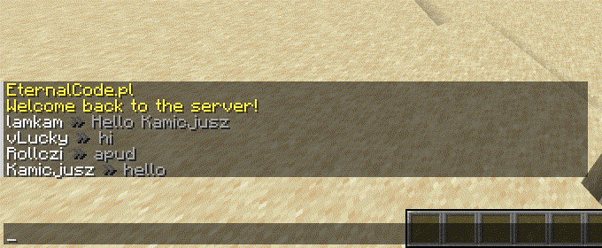

<div align="center">


[](https://raw.githubusercontent.com/intergrav/devins-badges/1aec26abb75544baec37249f42008b2fcc0e731f/assets/cozy/supported/paper_vector.svg)
[](https://modrinth.com/plugin/chatformatter)
[](https://hangar.papermc.io/EternalCodeTeam/EternalChatFormatter)

[](https://discord.gg/FQ7jmGBd6c)
[](https://raw.githubusercontent.com/vLuckyyy/badges/main/read-the-documentation.svg)
[](https://docs.eternalcode.pl/eternalcore/introduction)

</div>

> ⚠ **This plugin requires PlaceholderAPI and Vault to run!**

## 🌌 Preview:




## ✨ Features:

- PlaceholderAPI Support
- [MiniMessages Support](https://docs.adventure.kyori.net/minimessage/format.html) with Legacy Colors Support!
- Template System
- Custom Placeholders System
- Per-permission miniMessages Tags (see permissions below)

## 🔗 Useful links:

- [Web UI](https://webui.adventure.kyori.net)
- [MiniMessages Format](https://docs.adventure.kyori.net/minimessage/format.html)

## 🔑 Permissions:

| **Permission**                            | **Access**                                                              |
|:------------------------------------------|:------------------------------------------------------------------------|
| `chatformatter.decorations.*`             | `<bold>`, `<italic>`, `<underlined>`, `<strikethrough>`, `<obfuscated>` |
| `chatformatter.decorations.bold`          | `<bold>`                                                                |
| `chatformatter.decorations.italic`        | `<italic>`                                                              |
| `chatformatter.decorations.underlined`    | `<underlined>`                                                          |
| `chatformatter.decorations.strikethrough` | `<strikethrough>`                                                       |
| `chatformatter.decorations.obfuscated`    | `<obfuscated>`                                                          |
| `chatformatter.reset`                     | `<reset>`                                                               |
| `chatformatter.gradient`                  | `<gradient>`                                                            |
| `chatformatter.hover`                     | `<hover>`                                                               |
| `chatformatter.click`                     | `<click>`                                                               |
| `chatformatter.insertion`                 | `<insertion>`                                                           |
| `chatformatter.font`                      | `<font>`                                                                |
| `chatformatter.transition`                | `<transition>`                                                          |
| `chatformatter.translatable`              | `<lang>`                                                                |
| `chatformatter.selector`                  | `<selector>`                                                            |
| `chatformatter.keybind`                   | `<key>`                                                                 |
| `chatformatter.newline`                   | `<newline>`                                                             |
| `chatformatter.color.*`                   | `<red>`, `<blue>`, etc.                                                 |
| `chatformatter.legacycolor`               | `&c`, `&4`, `&l`, etc.                                                  |
| `chatformatter.color.black`               | `<black>`                                                               |
| `chatformatter.color.dark_blue`           | `<dark_blue>`                                                           |
| `chatformatter.color.dark_green`          | `<dark_green>`                                                          |
| `chatformatter.color.dark_aqua`           | `<dark_aqua>`                                                           |
| `chatformatter.color.dark_red`            | `<dark_red>`                                                            |
| `chatformatter.color.dark_purple`         | `<dark_purple>`                                                         |
| `chatformatter.color.gold`                | `<gold>`                                                                |
| `chatformatter.color.gray`                | `<gray>`                                                                |
| `chatformatter.color.dark_gray`           | `<dark_gray>`                                                           |
| `chatformatter.color.blue`                | `<blue>`                                                                |
| `chatformatter.color.green`               | `<green>`                                                               |
| `chatformatter.color.aqua`                | `<aqua>`                                                                |
| `chatformatter.color.red`                 | `<red>`                                                                 |
| `chatformatter.color.light_purple`        | `<light_purple>`                                                        |
| `chatformatter.color.yellow`              | `<yellow>`                                                              |
| `chatformatter.color.white`               | `<white>`                                                               |
| `chatformatter.reload`                    | `/chatformatter reload`                                                 |
| `chatformatter.receiveupdates`            | receive update announcements for this plugin                            |

### config.yml

```yaml
#    ____ _           _   _____      ChatFormatter       _   _            
#   / ___| |__   __ _| |_|  ___|__  _ __ _ __ ___   __ _| |_| |_ ___ _ __ 
#  | |   | '_ \ / _` | __| |_ / _ \| '__| '_ ` _ \ / _` | __| __/ _ \ '__|
#  | |___| | | | (_| | |_|  _| (_) | |  | | | | | | (_| | |_| ||  __/ |   
#   \____|_| |_|\__,_|\__|_|  \___/|_|  |_| |_| |_|\__,_|\__|\__\___|_|   


# Do you want to receive updates about new versions of ChatFormatter?
receiveUpdates: true

# Chat format for ranks (Vault) Support mini-messages and legacy colors

# We're recommending to use webui for mini-messages: https://webui.adventure.kyori.net/

# documentation is here: https://docs.adventure.kyori.net/minimessage/format.html

# You can check LuckPerms setup and placeholders here: https://luckperms.net/wiki/Placeholders
# 
# Example usages:
# 
# Hover message:
# One line: <hover:show_text:'<red>test'>TEST
# Multiple lines: <hover:show_text:'<red>test'>Test<newline>Test2</hover>
# 
# Click message:
# Open URL: <click:open_url:'https://webui.adventure.kyori.net'>TEST</click>
# Run command: <click:run_command:/say hello>Click</click> to say hello
# Suggest command: <click:suggest_command:'/msg {displayname}'></click>
# 
# RGB and gradient message usage: 
# <color:#ff00ee>Example message</color>
# <gradient:#ff00ee:#f79459>Example message</gradient>
# 
# You can use three more internal placeholders: <displayname> <name> <message>
# 
defaultFormat: "{displayname} » {message}"

# Here you can set different formats for each rank.
# Remember! Rank name must be exactly the same as in you permission plugin configuration.
# If player have more than one rank remember to correctly setup rank weight configuration
format:
  default: "{member} &7$hoverName({displayname}) &8» <gradient:#d4d4d4:white>{message} "
  vip: "{vip} &f$hoverName({displayname}) <dark_gray>» <gradient:#ffd270:white>{message}"
  mod: "{mod} &f$hoverName({displayname}) <dark_gray>» <gradient:#a3ff9e:white>{message}"
  admin: "{admin} &f$hoverName({displayname}) <dark_gray>» <gradient:#bac8ff:white><b>{message}"
  owner: "{owner} &f$hoverName({displayname}) <dark_gray>» <gradient:#ff9195:white><b>{message}"

# Placeholders, it allows you to make a shorter text, you can use some prefixes, characters etc. 
# You can use here PAPI placeholders.
placeholders:
  {displayname}: "<displayname>"
  {name}: "<name>"
  {message}: "<message>"
  {member}: "<#6e6764>Member"
  {vip}: "<gold>VIP"
  {mod}: "<b><#00c900>Mod</b>"
  {admin}: "<b><#6e86ff>Admin</b>"
  {owner}: "<b><gradient:#c40000:#e04b4b>Owner</b>"
  {rankDescription}: "<dark_gray>Rank: <white>%vault_group%"
  {joinDate}: "<dark_gray>Joined: <white>%player_first_join_date%"
  {health}: "<dark_gray>Health: <red>%player_health%"
  {lvl}: "<dark_gray>LVL: <gold>%player_level%"
  {privateMessage}: "<gradient:#36ff39:#75ff75><i>Click to send private message</i></gradient>"

# This section is made for experienced users
# It is used to shorten the text even more and keep the clean file!
templates:
  - "$hoverName($name) -> '<hover:show_text:'<dark_gray>Name: <white>$name<br><br>{rankDescription}<br>{joinDate}<br>{health}<br>{lvl}<br><br>{privateMessage}'><click:suggest_command:'/msg {displayname} '>{displayname}</click></hover>'"
```


